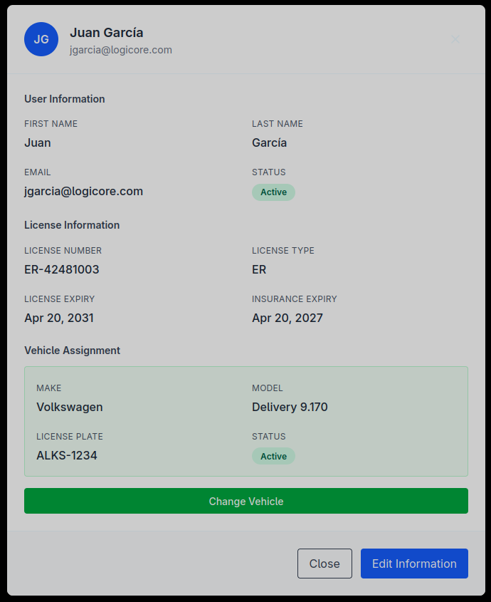

# LogiCore Front - Interfaz de Gestion Logistica

## Indice
- [Descripcion](#descripcion)
- [Arquitectura](#arquitectura)
- [Stack Tecnologico](#stack-tecnologico)
- [Librerias y Herramientas Principales](#librerias-y-herramientas-principales)
- [Estructura del Repositorio (Resumen)](#estructura-del-repositorio-resumen)
- [Buenas Practicas y Convenciones Aplicadas](#buenas-practicas-y-convenciones-aplicadas)
- [Patrones Implementados](#patrones-implementados)
- [Vistas de la Aplicacion](#vistas-de-la-aplicacion)
- [Proximos Pasos](#proximos-pasos)

## Descripcion
- **Proposito**: Interfaz web moderna para la plataforma LogiCore, como complemento visual del backend. Proyecto de aprendizaje en Next.js con buenas practicas de frontend.
- **Que hace**: Provee una UI por roles para gestionar conductores, vehiculos, ubicaciones, paquetes y envios, con formularios reactivos, validacion de entradas y consumo de la [LogiCore API](https://github.com/LucasCttr/logicore-back) a traves de GraphQL.
  - **Interfaz Admin**: CRUD completo para conductores, vehiculos, ubicaciones, paquetes, envios, usuarios y dashboard.
  - **Interfaz Driver**: scanner, vista de mis envios y gestion de perfil/licencia adaptadas para version mobile.
  - **Scanner de Paquetes**: Flujo basado en codigo de barras con acciones segun estado (recolectar, dejar en deposito, entregar).
- **Backend**: [.NET API con GraphQL: https://github.com/LucasCttr/logicore-back]

## Arquitectura
- **Patron**: Modular basado en componentes, separando responsabilidades en `components`, `hooks`, `api`, `app` y `types`.
- **Organizacion**:
  - `app/`: Rutas de Next.js (App Router) y layouts.
  - `components/`: Componentes reutilizables (formularios, listas, filtros, modales).
  - `hooks/`: Hooks custom para logica de datos y estado.
  - `api/`: Cliente GraphQL, autenticacion y servicios por dominio para consumir el backend.
  - `schemas/`: Validaciones con Zod.
  - `types/`: Tipos compartidos de TypeScript.

## Stack Tecnologico
- **Lenguaje**: `TypeScript`
- **Framework**: `Next.js 16.2.1` (App Router)
- **Estilos**: `Tailwind CSS`
- **Validacion**: `Zod` + `React Hook Form`
- **Cliente de datos**: `GraphQL` con apoyo de `Axios` para refresh de sesion
- **Estado**: `React Hooks` (useState, useContext)

## Librerias y Herramientas Principales
- **Next.js**: Framework React con SSR, SSG, rutas y optimizaciones automaticas.
- **Tailwind CSS**: Framework utilitario para estilado rapido y consistente.
- **TypeScript**: Tipado estatico y mejor DX.
- **GraphQL**: Capa principal de consumo de datos del backend con tipado y queries por dominio.
- **Axios**: Soporte para refresh de sesion y manejo de autorizacion cuando hace falta.
- **React Hook Form**: Manejo eficiente de formularios reactivos.
- **Zod**: Validacion de esquemas en compilacion y runtime.

## Estructura del Repositorio (Resumen)
- **src/app/**: Rutas de la aplicacion, layout raiz y paginas principales (drivers, locations, packages, shipments, vehicles).
  - **app/driver/**: Rutas protegidas por rol Driver con AuthGuard (`/driver/shipments`, `/driver/scanner`, `/driver/profile`).
  - **app/shipments/[id]**: Pagina dinamica de detalle de envio con timeline y lista de paquetes.
- **src/components/**: Componentes reutilizables (listas, formularios, filtros, modales, header, sidebar).
  - `DepotIngressScanner.tsx`: Scanner de codigo de barras con flujo de recoleccion y botones de accion inteligentes.
  - `AuthGuard.tsx`: Proteccion de rutas por rol (Admin / Driver).
  - `SectionHeader.tsx`: Titulos dinamicos segun la ruta.
- **src/hooks/**: Hooks custom para consultar datos, manejar estado local y validar logica.
- **src/api/**: Servicios GraphQL por dominio (drivers, vehicles, locations, packages, shipments, users y auth).
- **src/schemas/**: Esquemas Zod para validacion de formularios e inputs.
- **src/types/**: Tipos compartidos para DTOs y modelo de dominio.
  - `scanner.ts`: Tipo `PackageForScannerDto`.
- **public/**: Recursos estaticos.

## Patrones Implementados
- **Custom Hooks Pattern**: encapsulacion de fetching, estado y errores en hooks reutilizables.
- **Component Composition**: composicion de componentes base (Form, List, Filter, Modal) para vistas especificas.
- **API Client Pattern**: centralizacion del cliente GraphQL en `api/graphqlClient.ts` y soporte auxiliar de `api/axiosClient.ts` para refresh de sesion.
- **Schema Validation Pattern**: validaciones declarativas con Zod, integradas con React Hook Form.
- **Role-Based Routing**: parseo de JWT para extraer roles y proteger rutas con `AuthGuard`.
- **Context API**: estado global opcional para autenticacion/tema segun providers disponibles.
- **Middleware / Interceptors**: inyeccion de JWT y manejo de errores 401/403.
- **Controlled Components**: formularios controlados con validacion en tiempo real.
- **Responsive Layout**: Sidebar + Main Content para mobile/tablet/desktop.
- **Loading & Error States**: feedback visual para loading, success y error.
- **Scanner State Machine**: flujo de acciones segun estado del paquete:
  - Pending -> Collect | Skip
  - InTransit -> Drop at Depot
  - AtDepot -> Customer Pickup (solo LastMile)

## Vistas de la Aplicacion
Las siguientes capturas muestran las vistas principales del frontend, agrupadas por flujo para una lectura mas limpia.

### 1. Operacion de Administracion
Vistas centralizadas para supervisar el sistema y gestionar la operacion diaria.

- **Dashboard de admin**: resumen operativo de alto nivel y accesos rapidos a las acciones principales.
- **Envios**: listado y administracion de envios, estados y asignaciones.
- **Paquetes**: revision del ciclo de vida, filtros y acciones segun estado.

*Panel principal para administradores con resumen operativo y monitoreo general.*

*Vista de gestion de envios con seguimiento de estados y control operativo.*

*Vista de gestion de paquetes con busqueda, filtros y acciones del ciclo logistico.*

---

### 2. Flujo de Envios
Pantallas paso a paso para crear y revisar envios.

- **Crear envio - paso 1**: datos base, tipo de envio y parametros principales.
- **Crear envio - paso 2**: asociar paquetes y validar detalles operativos.
- **Crear envio - paso 3**: confirmacion final antes de crear el envio.
- **Detalle de envio**: linea de tiempo, destino, chofer y paquetes transportados.

*Primer paso del flujo de creacion de envios.*

*Segundo paso para asociar paquetes y definir el envio.*

*Paso final de revision y confirmacion antes de guardar el envio.*

*Vista detallada del envio con historial, destino y chofer asignado.*

---

### 3. Experiencia del Conductor
Pantallas orientadas al uso mobile para el rol de conductor.

- **Dashboard del conductor**: acceso rapido a tareas asignadas y actividad del dia.
- **Vista de envios del conductor**: listado mobile-friendly de los envios asignados al conductor autenticado.
- **Perfil del conductor**: gestion de perfil y licencia.
- **Detalle del conductor**: consulta de informacion personal, licencia y estado operativo.

*Dashboard mobile para conductores con accesos rapidos y navegacion operativa.*

*Vista responsive de envios para el conductor autenticado en celular.*

*Pantalla de detalle del conductor con informacion personal, licencia y estado operativo para revisar rapidamente su perfil.*

---

### 4. Scanner y Acciones de Campo
Pantallas operativas para gestionar paquetes mediante codigo de barras.

- **Scanner**: escaneo de paquetes para recolectar, mover a deposito o entregar segun el estado.

*Flujo de escaneo para recoleccion, ingreso a deposito y acciones de entrega.*

---

### 5. Gestion de Datos Maestros
Pantallas administrativas para entidades de catalogo y control de acceso.

- **Conductores**: administracion de registros y disponibilidad.
- **Vehiculos**: gestion de la flota y su estado operativo.
- **Ubicaciones**: creacion y mantenimiento de sucursales y depositos.
- **Usuarios**: gestion de usuarios, roles y permisos de acceso.

*Listado y gestion de conductores con busqueda, filtros y control de disponibilidad.*

*Pantalla de gestion de flota para asignar y mantener vehiculos.*

*Vista administrativa para sucursales y depositos.*

*Pantalla de administracion de usuarios con roles y activacion.*

## Buenas Practicas y Convenciones Aplicadas
- **Separacion de responsabilidades**: componentes (presentacion), hooks (logica), api (comunicacion).
- **Componentes reutilizables**: listas, formularios, filtros y modales genericos para evitar duplicacion.
- **Hooks custom**: encapsulan logica de datos y estado (por ejemplo `useDrivers`, `useVehicles`, `usePackages`).
- **Validacion en capas**: Zod para esquemas y React Hook Form para UX reactiva.
- **Cliente API tipado**: queries y mutaciones GraphQL tipadas con TypeScript para mayor seguridad.
- **Autenticacion**: interceptores HTTP para manejar JWT; parseo de token para extraer roles.
- **Control de acceso por rol**: AuthGuard protege rutas segun roles Admin/Driver.
- **Diseno responsive**: Tailwind con breakpoints para multiples tamanos de pantalla.
- **Manejo de errores**: captura centralizada y notificacion al usuario.
- **Estados de carga**: feedback visual durante consultas (loading, placeholders, etc.).
- **Modales y formularios dinamicos**: componentes controlados para crear/editar/eliminar recursos.
- **UI basada en estado**: scanner y acciones se adaptan segun estado del paquete y tipo de envio.

## Proximos Pasos
- Consolidar el estado global solo si la complejidad del flujo lo requiere.
- Implementar/Terminar funcionalidades.
- Agregar tests unitarios (Jest + React Testing Library).
