# LogiCore Front - Interfaz de Gestion Logistica

## Indice
- [Descripcion](#descripcion)
- [Arquitectura](#arquitectura)
- [Stack Tecnologico](#stack-tecnologico)
- [Librerias y Herramientas Principales](#librerias-y-herramientas-principales)
- [Estructura del Repositorio (Resumen)](#estructura-del-repositorio-resumen)
- [Buenas Practicas y Convenciones Aplicadas](#buenas-practicas-y-convenciones-aplicadas)
- [Patrones Implementados](#patrones-implementados)
- [Vistas de la Aplicacion](#vistas-de-la-aplicacion)
- [Proximos Pasos](#proximos-pasos)

## Descripcion
- **Proposito**: Interfaz web moderna para la plataforma LogiCore, como complemento visual del backend. Proyecto de aprendizaje en Next.js con buenas practicas de frontend.
- **Que hace**: Provee una UI por roles para gestionar conductores, vehiculos, ubicaciones, paquetes y envios, con formularios reactivos, validacion de entradas y consumo de la [LogiCore API](https://github.com/LucasCttr/LogiCoreBack).
  - **Interfaz Admin**: CRUD completo para conductores, vehiculos, ubicaciones, paquetes, envios y usuarios.
  - **Interfaz Driver**: Scanner optimizado para celular, vista de mis envios y gestion de perfil/licencia.
  - **Scanner de Paquetes**: Flujo basado en codigo de barras con acciones segun estado (recolectar, dejar en deposito, entregar).
- **Backend**: [.NET API: https://github.com/LucasCttr/logicore-back]

## Arquitectura
- **Patron**: Modular basado en componentes, separando responsabilidades en `components`, `hooks`, `api`, `app` y `types`.
- **Organizacion**:
  - `app/`: Rutas de Next.js (App Router) y layouts.
  - `components/`: Componentes reutilizables (formularios, listas, filtros, modales).
  - `hooks/`: Hooks custom para logica de datos y estado.
  - `api/`: Cliente HTTP y servicios para consumir el backend.
  - `schemas/`: Validaciones con Zod.
  - `types/`: Tipos compartidos de TypeScript.

## Stack Tecnologico
- **Lenguaje**: `TypeScript`
- **Framework**: `Next.js 15+` (App Router)
- **Estilos**: `Tailwind CSS`
- **Validacion**: `Zod` + `React Hook Form`
- **Cliente HTTP**: `Axios`
- **Estado**: `React Hooks` (useState, useContext)
- **Linting**: `ESLint`

## Librerias y Herramientas Principales
- **Next.js**: Framework React con SSR, SSG, rutas y optimizaciones automaticas.
- **Tailwind CSS**: Framework utilitario para estilado rapido y consistente.
- **TypeScript**: Tipado estatico y mejor DX.
- **Axios**: Cliente HTTP con interceptores para autorizacion y manejo de errores.
- **React Hook Form**: Manejo eficiente de formularios reactivos.
- **Zod**: Validacion de esquemas en compilacion y runtime.
- **ESLint**: Analisis estatico de codigo para mantener calidad y consistencia.

## Estructura del Repositorio (Resumen)
- **src/app/**: Rutas de la aplicacion, layout raiz y paginas principales (drivers, locations, packages, shipments, vehicles).
  - **app/driver/**: Rutas protegidas por rol Driver con AuthGuard (`/driver/shipments`, `/driver/scanner`, `/driver/profile`).
  - **app/shipments/[id]**: Pagina dinamica de detalle de envio con timeline y lista de paquetes.
- **src/components/**: Componentes reutilizables (listas, formularios, filtros, modales, header, sidebar).
  - `DepotIngressScanner.tsx`: Scanner de codigo de barras con flujo de recoleccion y botones de accion inteligentes.
  - `AuthGuard.tsx`: Proteccion de rutas por rol (Admin / Driver).
  - `SectionHeader.tsx`: Titulos dinamicos segun la ruta.
- **src/hooks/**: Hooks custom para consultar datos, manejar estado local y validar logica.
- **src/api/**: Configuracion de Axios y servicios por endpoint (drivers, vehicles, locations, packages, shipments).
- **src/schemas/**: Esquemas Zod para validacion de formularios e inputs.
- **src/types/**: Tipos compartidos para DTOs y modelo de dominio.
  - `scanner.ts`: Tipo `PackageForScannerDto`.
- **public/**: Recursos estaticos.

## Buenas Practicas y Convenciones Aplicadas
- **Separacion de responsabilidades**: componentes (presentacion), hooks (logica), api (comunicacion).
- **Componentes reutilizables**: listas, formularios, filtros y modales genericos para evitar duplicacion.
- **Hooks custom**: encapsulan logica de datos y estado (por ejemplo `useDrivers`, `useVehicles`, `usePackages`).
- **Validacion en capas**: Zod para esquemas y React Hook Form para UX reactiva.
- **Cliente API tipado**: Axios configurado con tipos TypeScript para mayor seguridad.
- **Autenticacion**: interceptores HTTP para manejar JWT; parseo de token para extraer roles.
- **Control de acceso por rol**: AuthGuard protege rutas segun roles Admin/Driver.
- **Diseno responsive**: Tailwind con breakpoints para multiples tamanos de pantalla.
- **Manejo de errores**: captura centralizada y notificacion al usuario.
- **Estados de carga**: feedback visual durante consultas (loading, placeholders, etc.).
- **Modales y formularios dinamicos**: componentes controlados para crear/editar/eliminar recursos.
- **UI basada en estado**: scanner y acciones se adaptan segun estado del paquete y tipo de envio.

## Patrones Implementados
- **Custom Hooks Pattern**: encapsulacion de fetching, estado y errores en hooks reutilizables.
- **Component Composition**: composicion de componentes base (Form, List, Filter, Modal) para vistas especificas.
- **API Client Pattern**: centralizacion del cliente HTTP en `api/axiosClient.ts` con interceptores.
- **Schema Validation Pattern**: validaciones declarativas con Zod, integradas con React Hook Form.
- **Role-Based Routing**: parseo de JWT para extraer roles y proteger rutas con `AuthGuard`.
- **Context API**: estado global opcional para autenticacion/tema segun providers disponibles.
- **Middleware / Interceptors**: inyeccion de JWT y manejo de errores 401/403.
- **Controlled Components**: formularios controlados con validacion en tiempo real.
- **Responsive Layout**: Sidebar + Main Content para mobile/tablet/desktop.
- **Loading & Error States**: feedback visual para loading, success y error.
- **Scanner State Machine**: flujo de acciones segun estado del paquete:
  - Pending -> Collect | Skip
  - InTransit -> Drop at Depot
  - AtDepot -> Customer Pickup (solo LastMile)

## Vistas de la Aplicacion
A continuacion se muestran las vistas principales del frontend con una breve descripcion funcional.

### Dashboard de Admin
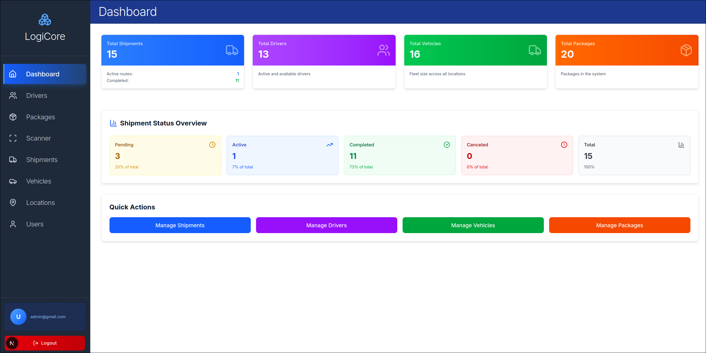
Vista principal para administradores con resumen operativo, accesos directos de gestion y monitoreo general de la operacion logistica.

### Dashboard de Driver
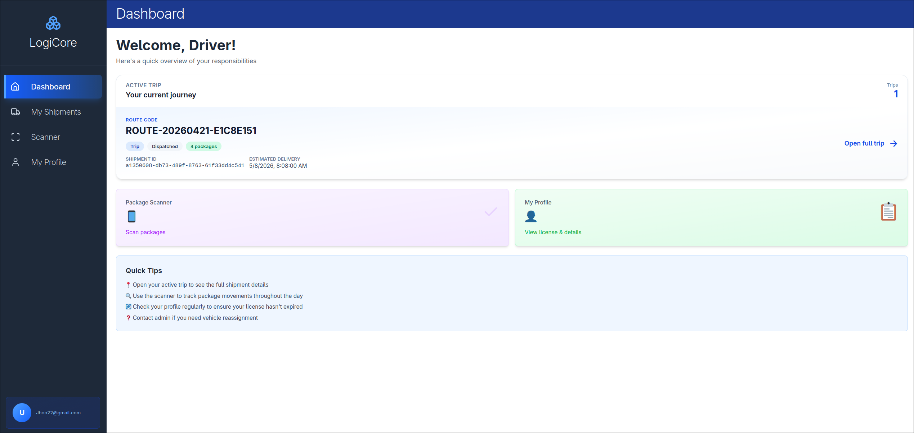

Vista inicial para el conductor con accesos rapidos a sus tareas del dia, metricas basicas y navegacion operativa.

### Mis Envios (Driver)
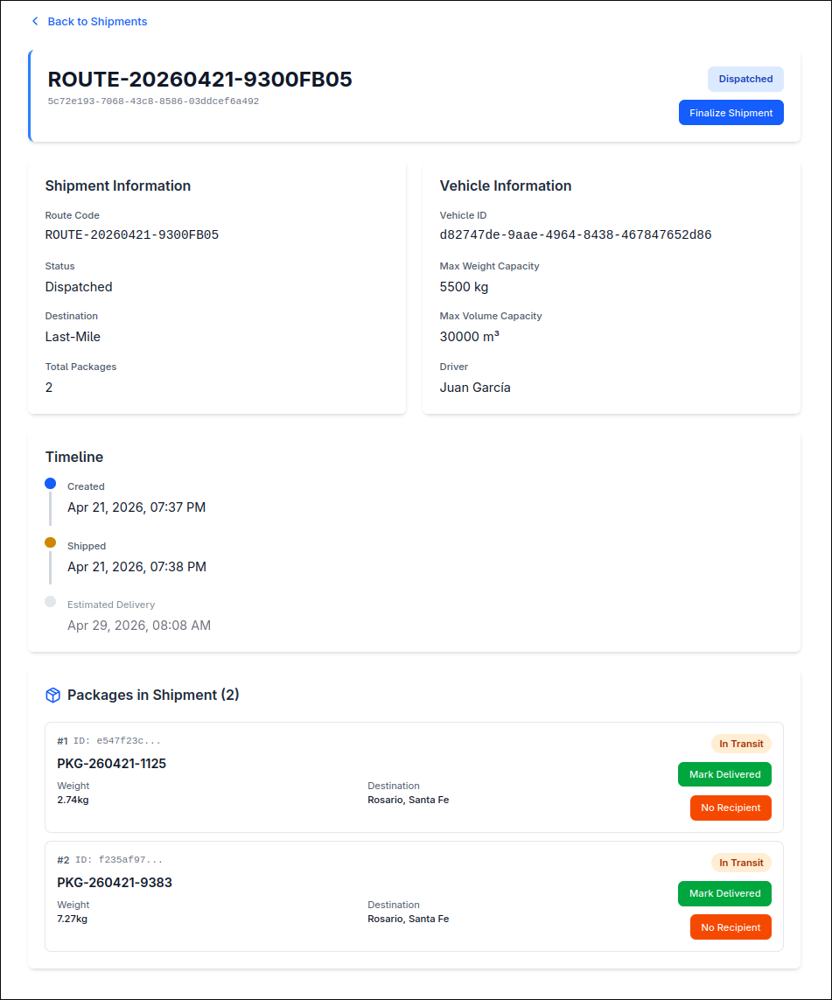
Muestra informacion de envios: tipo, destino, ubicacion, cambio de estados, chofer, paquetes transportados.

### Gestion de Envios
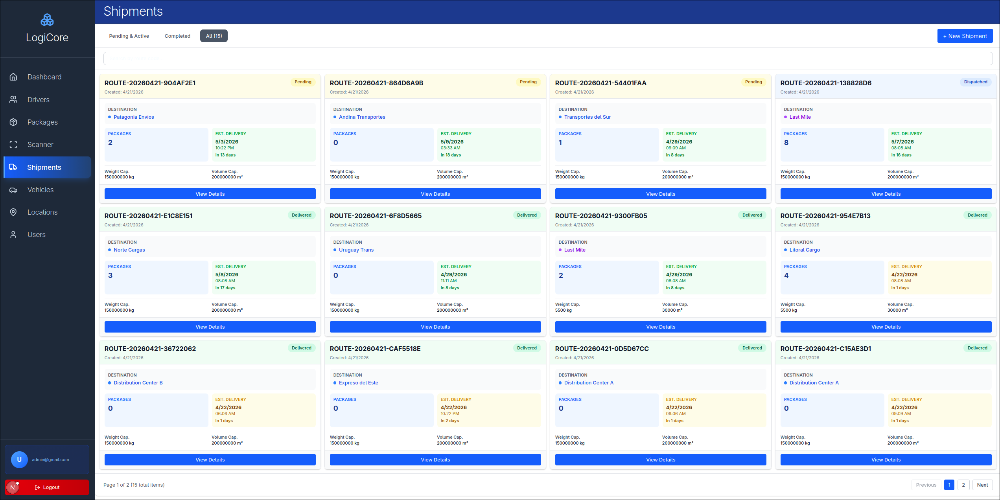
Administra envios con estados, asignaciones y seguimiento de progreso general.

### Vista Mobile
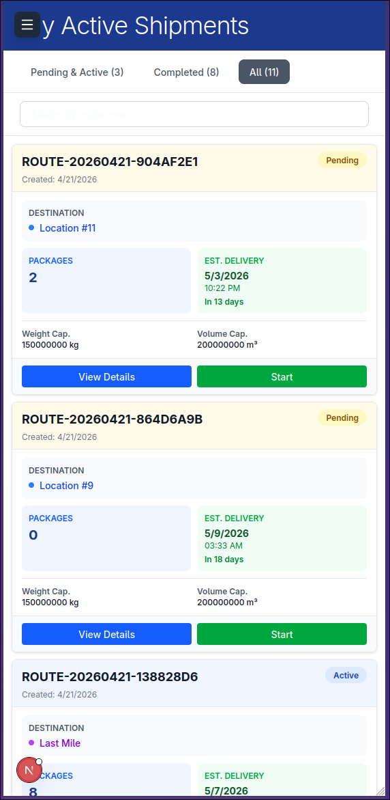
Diseño adaptado a celular para operacion en campo, priorizando acciones grandes y navegacion rapida.

### Gestion de Paquetes
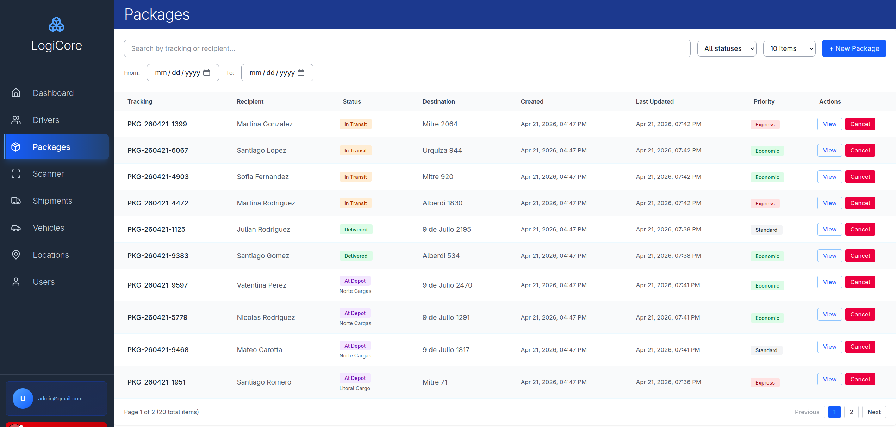
Vista de paquetes con busqueda, filtros y acciones segun ciclo logistico.

### Detalle de Paquete
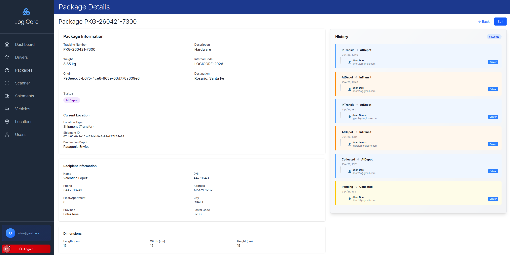
Muestra informacion completa del paquete, su trazabilidad y datos asociados al envio.

### Crear Envio - Paso 1
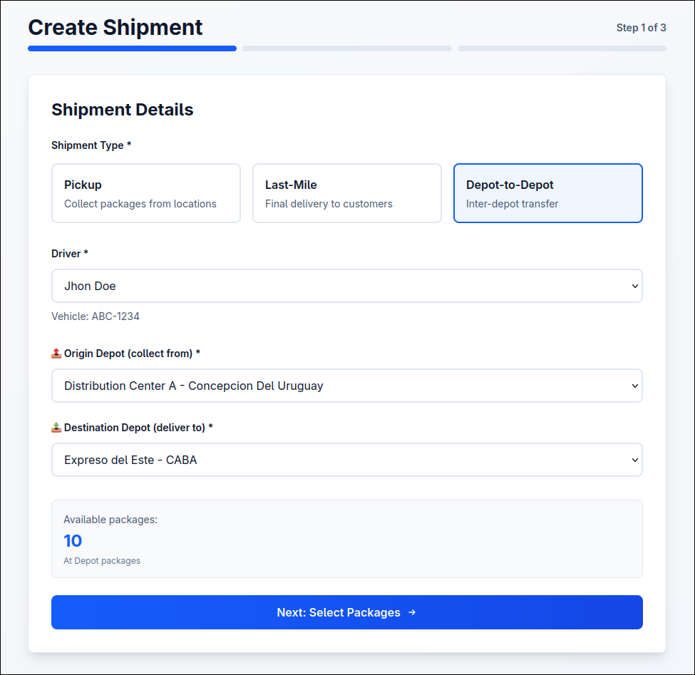
Primer paso del alta de envio: datos base, tipo de envio y parametros principales.

### Crear Envio - Paso 2
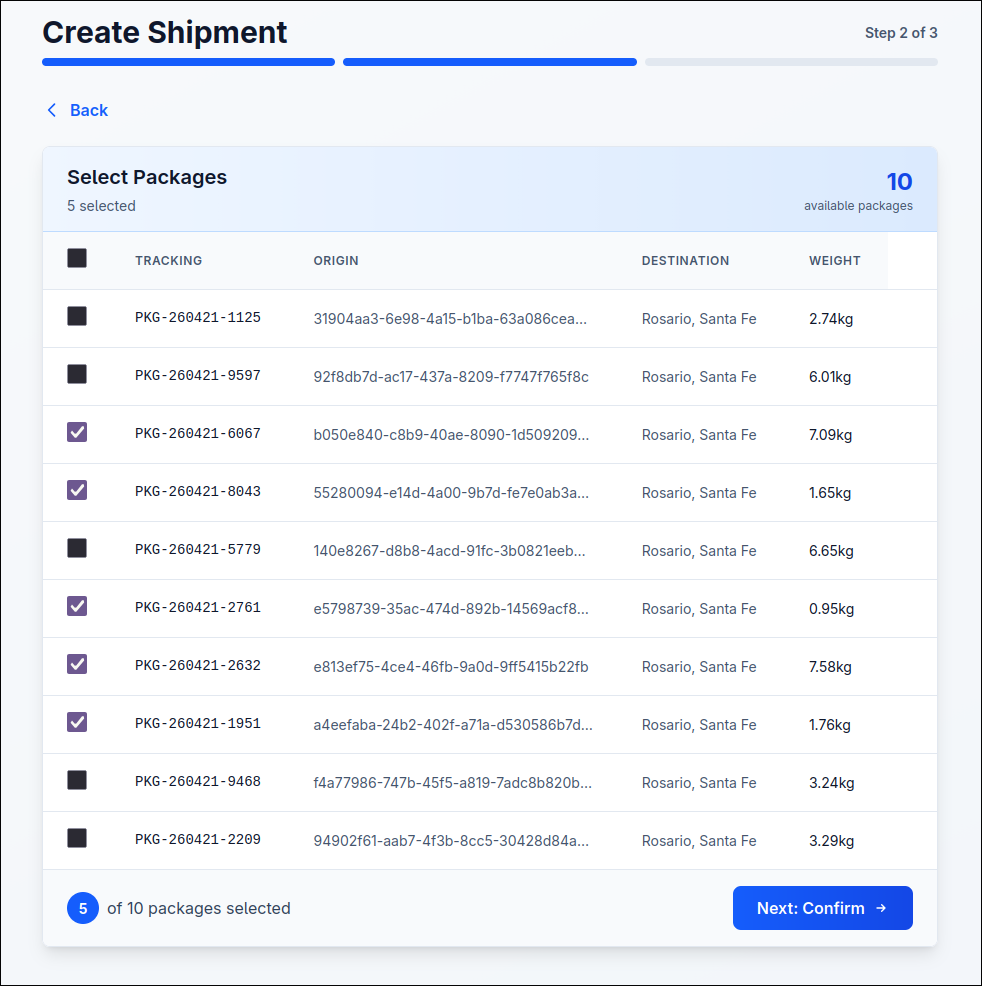
Segundo paso para asociar paquetes, validar informacion y definir detalles operativos.

### Crear Envio - Paso 3
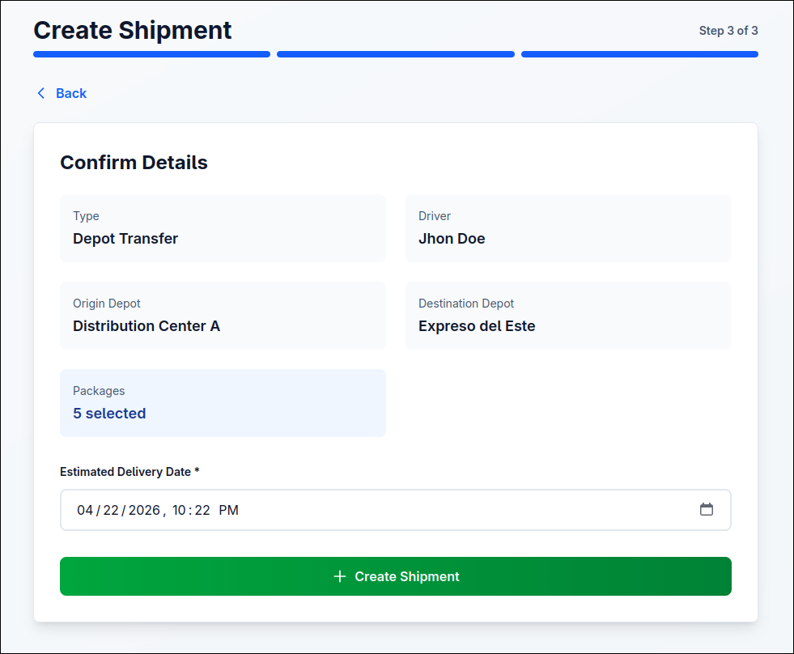
Paso final de confirmacion y revision antes de crear el envio.

### Scanner
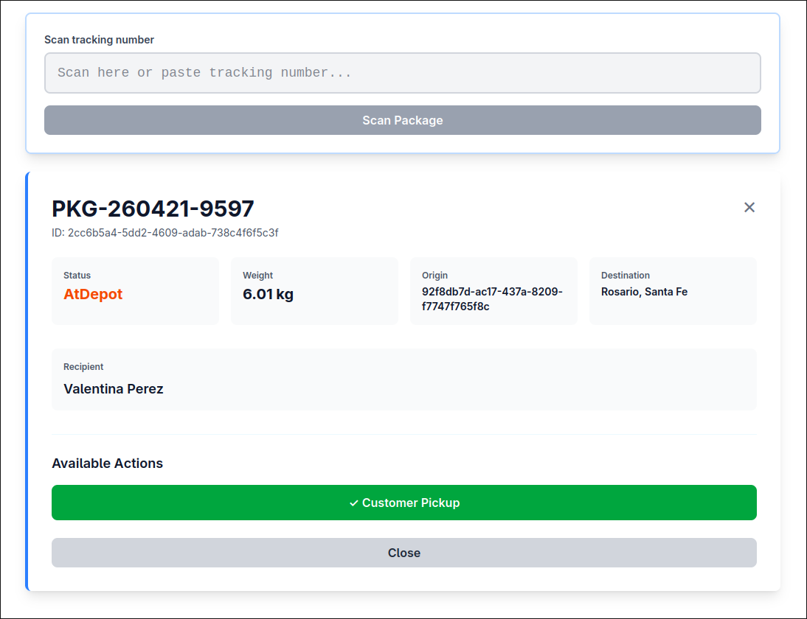
Flujo de escaneo de codigos para registrar recoleccion, ingreso a deposito y entrega, aplicando reglas por estado.

### Gestion de Conductores
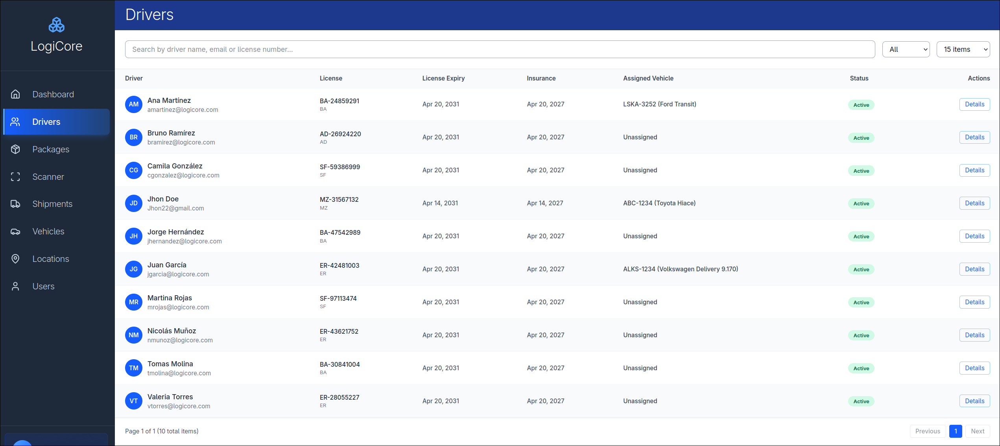
Listado y administracion de conductores: consulta, filtros, alta, edicion y control de disponibilidad.

### Gestion de Vehiculos
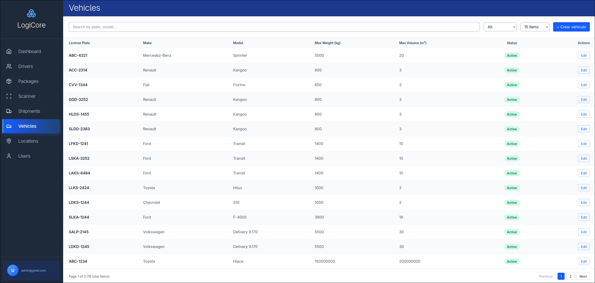
Pantalla para administrar la flota, asignaciones y estado operativo de los vehiculos.

### Gestion de Ubicaciones
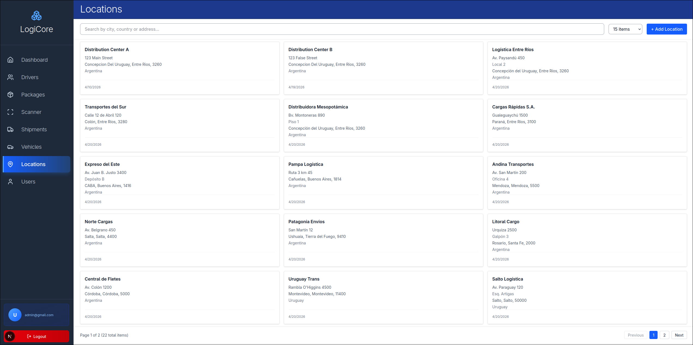
Permite crear y administrar sucursales/depositos con su informacion operativa.

### Gestion de Usuarios
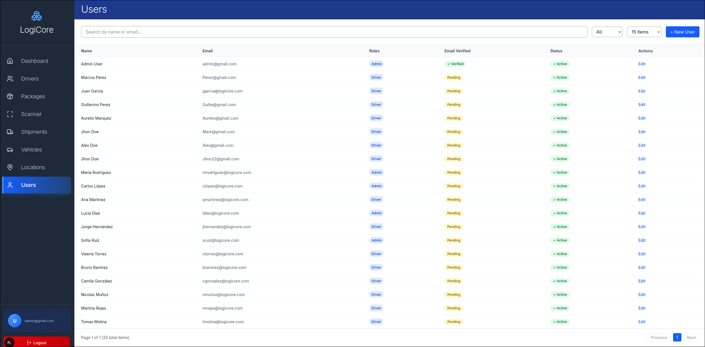
Administracion de usuarios del sistema: roles, activacion y permisos de acceso.

## Proximos Pasos
- Implementar/Terminar funcionalidades.
- Agregar tests unitarios (Jest + React Testing Library).
- Arreglar bugs.

